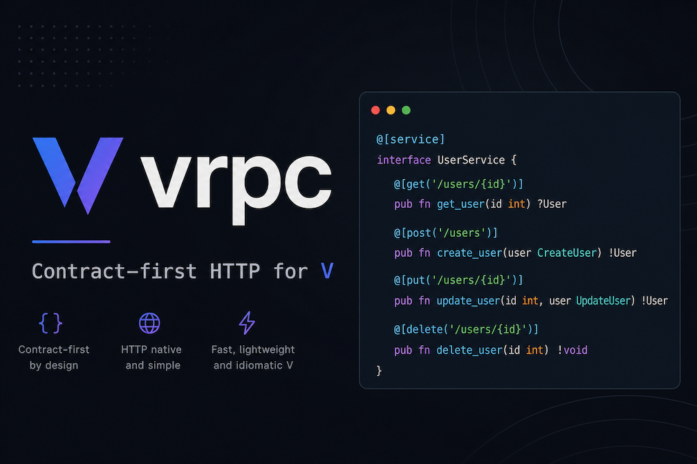

# vrpc



**Contract-first HTTP service framework for [V](https://vlang.io).**

[](https://github.com/franklinharvey/vrpc/actions/workflows/ci.yml)
[](LICENSE)
[](https://vlang.io)

Define service contracts and payload structs once. vrpc generates HTTP routing, JSON binding, validation, OpenAPI, and typed clients — V and TypeScript today, more targets via the same IR pipeline.

> **Status:** v0.1.0 MVP — actively developed. See [CHANGELOG](CHANGELOG.md) and [roadmap](#roadmap).

## Why vrpc

Most frameworks start with routes:

```v
app.post('/users', create_user)
```

vrpc starts with the service procedure. HTTP is derived from the contract:

```v
@[service; prefix: '/users']
pub interface UserService {
	@[post: '/']
	create_user(CreateUserRequest) !CreateUserResponse

	@[get: '/:id']
	get_user(GetUserRequest) !GetUserResponse
}
```

One contract drives the server mount, OpenAPI document, V client, and TypeScript `fetch` client (with optional Zod schemas).

## Quick start

**Requirements:** V 0.5+ ([install](https://github.com/vlang/v)). On macOS, tests may need `export LIBRARY_PATH="/opt/homebrew/lib:$LIBRARY_PATH"`.

```bash
git clone https://github.com/franklinharvey/vrpc.git
cd vrpc

# Run the full users example (contract → generated server → OpenAPI + docs)
cd examples/users
v install
v run .

# In another terminal
curl -s http://127.0.0.1:3000/openapi.json | head
open http://127.0.0.1:3000/docs
```

**Minimal server** (no contracts):

```bash
cd examples/hello
v run .    # GET http://127.0.0.1:3001/hello
```

## Features

- **Contract-first services** — `@[service]` interfaces with `@[get]`, `@[post]`, and path templates
- **Unified request structs** — bind body, path, query, and header fields into one typed struct
- **Validation** — `required`, `min`/`max`, `min_len`/`max_len`, `email`, `uuid` with structured 400 responses
- **Code generation** — `vgen` emits V mounts/clients, TypeScript clients, OpenAPI 3.0, and Zod schemas
- **OpenAPI + docs** — `app.openapi()` and built-in Swagger UI at `/docs`
- **Small runtime** — explicit metadata and codegen instead of reflection-heavy magic
- **Single binary** — standard V deployment story

## Examples

| Example | What it shows | Run |
|---------|---------------|-----|
| [hello](examples/hello/) | Minimal JSON HTTP server | `cd examples/hello && v run .` → `:3001` |
| [users](examples/users/) | Full contract stack, e2e tests, TS + OpenAPI output | `cd examples/users && v run .` → `:3000` |
| [htmx](examples/htmx/) | HTML partials and HTMX interactions | `cd examples/htmx && v run .` → `:3002` |

## Code generation

From the `vrpc` module directory:

```bash
cd vrpc

# V server mount + V client
v run cmd/vgen generate ../examples/users --target v,v_client

# TypeScript fetch client → examples/users/user/*.ts
v run cmd/vgen generate ../examples/users --target ts

# OpenAPI JSON + optional Zod runtime schemas
v run cmd/vgen generate ../examples/users --target openapi
v run cmd/vgen generate ../examples/users --target ts --zod
v run cmd/vgen openapi ../examples/users   # print OpenAPI to stdout
```

See [vrpc/README.md](vrpc/README.md) for CLI details and layout.

## Install as a module

```bash
v install github.com/franklinharvey/vrpc@v0.1.0
```

(Or vendor this repo and add a `v.mod` dependency path to `vrpc/`.)

## Development

Same checks locally and in CI:

```bash
./scripts/ci.sh
```

Docker (Ubuntu + V 0.5.1, no local V install):

```bash
docker build --platform linux/amd64 -f Dockerfile.ci -t vrpc-ci .
docker run --rm --platform linux/amd64 vrpc-ci
```

| Path | Purpose |
|------|---------|
| [vrpc/](vrpc/) | Runtime library + `vgen` CLI |
| [examples/](examples/) | Runnable demos and e2e tests |
| [brief.md](brief.md) | Full design document |
| [CONTRIBUTING.md](CONTRIBUTING.md) | How to contribute |
| [SECURITY.md](SECURITY.md) | Security reporting |

## Roadmap

- Additional language emitters via the IR pipeline
- Trie router and richer contract parsing
- More examples (`validation`, structured errors)

Implementation tracking lives in [TASKS.md](TASKS.md) (maintainer-facing).

## License

[MIT](LICENSE) © Franklin Harvey
